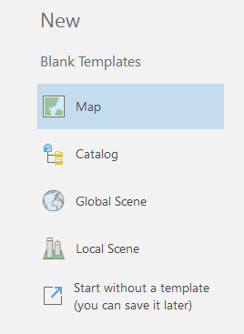
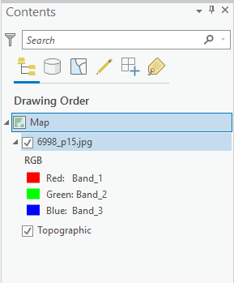

## About
Last Updated *[06/06/2019]*   
Created by [OSU Maps and Spatial Data](https://info.library.okstate.edu/map-room)

## Table of Contents
- Introduction 
- *[Digitizing in ArcGIS Pro]*
- - Starting a New Project
- - Adding Files
- - Digitizing
- - - Feature Dataset
- - - Feature Class
- - - Snapping?
- - - Saving?
- - - Point Features
- - - Line Features
- - - Polygon Features
- - Editing
- - - Auto-complete Digitizing
- - - Merging
- - - Splitting
- Conclusion
- Further Reading/Resources

## Introduction
Digitizing allows image data to be converted to vector digital data. This is accomplished by manually digitizing objects by tracing lines or adding points based on the source media. 

## *[Digitizing in ArcGIS Pro]*

#### Starting a New Project

1. To begin a new project, open ArcGIS on your desktop.
2. Click **Map** under *New, Blank Templates*.
    

3. Name the project and choose a file location that will be easy to access. Then click **OK**. A new world map should open. 

#### Adding Files
Now that a new project has been created, a folder connection must be added to import data. 
1. To do this, click **Add Folder** under the *Insert* tab of the toolbar to create a folder connection.

2. Select the desired folder and click **OK**.
3. The folder connection should appear under *Folders* in the *Catalog* pane. 

4. Locate desired data. Right click the file and click **Add to Current Map**. The selected file is now added to the project and should appear in the *Contents* pane. It is okay if the raster is not displayed on the map as long as the file is visible in the Contents pane.

*Note: For georeferencing in ArcGIS Pro, JPGs are the preferred file type.*
## *[delicious content]*

#### Digitizing

##### Feature Dataset

##### Feature Class

##### Snapping?

##### Saving?

##### Point Features

##### Line Features

##### Polygon Features

#### Editing

##### Auto-complete Digitizing

##### Merging

##### Splitting

## Conclusion

## Further Reading/Resources

[Return to Top](#about)
