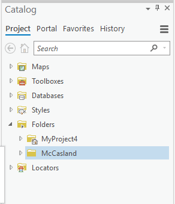

## About
Last Updated *[06/06/2019]*   
Created by [OSU Maps and Spatial Data](https://info.library.okstate.edu/map-room)

## Table of Contents
- Introduction 
- *[Digitizing in ArcGIS Pro]*
- - Starting a New Project
- - Adding Files
- - Digitizing
- - - Feature Dataset
- - - Feature Class
- - - Saving?
- - - Point Features
- - - Line Features
- - - Polygon Features
- - - Deleting Features
- - Editing
- - - Merge
- - - Split
- Conclusion
- Further Reading/Resources

## Introduction
Digitizing allows image data to be converted to vector digital data. This is accomplished by manually digitizing objects by tracing lines or adding points based on the source media. 

#### Starting a New Project

1. To begin a new project, open ArcGIS on your desktop.
2. Click **Map** under *New, Blank Templates*.
    

3. Name the project and choose a file location that will be easy to access. Then click **OK**. A new world map should open. 

#### Adding Files
Now that a new project has been created, a folder connection must be added to import data. 
1. To do this, click **Add Folder** under the *Insert* tab of the toolbar to create a folder connection.

2. Select the desired folder and click **OK**.
3. The folder connection should appear under *Folders* in the *Catalog* pane. 

4. Locate desired data. Right click the file and click **Add to Current Map**. The selected file is now added to the project and should appear in the *Contents* pane. It is okay if the raster is not displayed on the map as long as the file is visible in the Contents pane.

*Note: For georeferencing in ArcGIS Pro, JPGs are the preferred file type.*

#### Digitizing
Images are turned into vector digital data through the proccess of manually digitizing the images. 

##### Feature Dataset
Why do we create feature data sets?
1. To create a feature dataset, right click the desired GDB file in the *Databases* folder of the *Catalog* pane. 
2. Select **NEW** and **Feature Dataset**.

3. A *geoprocessing* pane should appear. Give the dataset a title and select the desired coordinate system. Then click **Run** at the bottom of the pane. Once this process is complete, a green box should appear at the bottom of the *geoprocessing* pane declaring success. 

##### Feature Class
Why do we create feature classes? 

1.To create a feature class, right click the desired GDB file in the *Databases* folder of the *Catalog* pane. 
2. Select **NEW** and **Feature Class**.

3. A *Create Feature Class* pane should appear. Give the class a name, select the desired feature class type and continue through the next few pages. These pages allow you to import fields, select the desired coordinate system, set tolerance, alter resolution and specify storage configuration. 

4. The new feature class will appear in the *catalog* pane under the feature database that was previously created. To add the layer to the project, right click and select **Add to Current Map**. A new layer should appear in the *Contents* pane. 

##### Saving?

##### Point Features
1. To add point features, be sure to select **Point** as the desired feature class when creating a feature class.
2. Go to the *Edit* tab of the toolbar and select **Create**. A *Create Features* pane should appear.

3. In the *Create Features* pane, select the layer you want to digitize (wording). A few tools will appear under the layer. Select **Point**. Points can now be added as desired.

4. To add a point, simply locate an object you would like to mark and click in the center 

5. Continue adding points as desired. 

##### Line Features
1. To add line features, be sure to select **Line** as the desired feature class when creating a feature class.
2. Go to the *Edit* tab of the toolbar and select **Create**. A *Create Features* pane should appear.
3. In the *Create Features* pane, select the layer you want to digitize (wording). A few tools will appear under the layer. Select **Line**. Lines can now be added as desired.

4. To create a line, decide where the line should start and click. A vertext should appear. Add another vertex to create a line.

5. More vertexes can be added to create a longer line or to manipulate the shape of the line.

##### Polygon Features
1. To add polygon features, be sure to select *Polygon** as the desired feature class when creating a feature class.
2. Go to the *Edit* tab of the toolbar and select **Create**. A *Create Features* pane should appear.
3. In the *Create Features* pane, select the layer you want to digitize (wording). A few tools will appear under the layer. Select **Polygon**. Polygons can now be added as desired.

4. To create a polygon, decide where the polygon should start and click. A vertext should appear. Add another vertex to create a line and continue this process until the shape is closed.

5. To finish a polygon, double click on the last vertex that was placed. The polygon outline should appear highlighted. 

##### Deleting Features
1. To delete a digitized feature, click **Select** in the *Edit* tab of the toolbar.

2. Right click the feature and choose **Delete**. It should disappear. 

### Editing
Digitized features may be edited after they are created. The three most common editing tools involve merging, splitting and auto-complete digizing. 

#### Merge
Merging a tool taht allows different features to be merged into one.

1. To merge digitized features, click **Merge** under the *Edit* tab. 

2. A *Modify Features* pane should appear. You can select the desired features in one of two ways:
- 1. With the **Merge** tool activated, click on the first desired feature. Hold down **CTRL** on the keyboard and select the remaining features. The features will appear highlighted.
- 2. Use the mouse to draw a box around the desired features by left clicking and holding as you drag the box over the desired area. The features will appear highlighted.

3. After the features have been selected, click **Merge** in the bottom right hand corner of the *Modify Features* pane. 

#### Split

#### Auto-Complete Digitizing

## Conclusion

## Further Reading/Resources

[Return to Top](#about)
